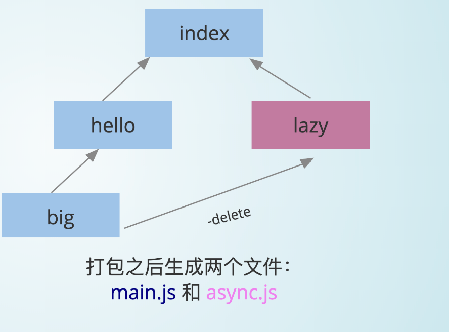
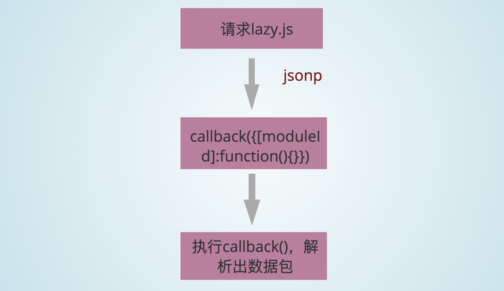
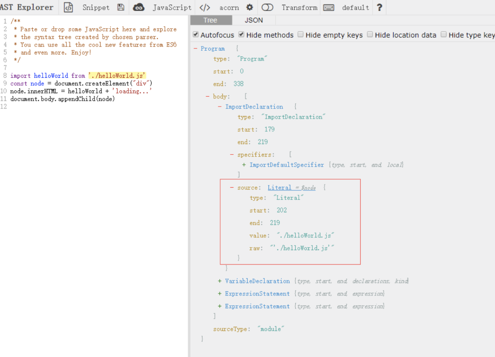

本文参考`webpack`创始人 Tobias Koppers 的视频 [Webpack founder Tobias Koppers demos bundling live by hand](https://www.youtube.com/watch?v=UNMkLHzofQI),梳理`webpack`打包过程。
# 手动打包文件
## 文件目录
我们准备一个极简单的项目来进行打包，目录结构和内容如下：
```
+-- src
| +-- big.js
| +-- helloWorld.js
| +-- index.js
| +-- lazy.js
```
index.js
```javascript
import helloWorld from './helloWorld'
const node = document.createElement("div")
node.innerHTML = helloWorld + 'loading...'
import(/* webpackChunkName: "async" */ './lazy').then(({ default: lazy }) => {
node.innerHTML = helloWorld + lazy
})
document.body.appendChild(node)
```
helloWorld.js
```javascript
import big from './big'
const helloWorld = big('hello world!')
export default helloWorld
```
big.js
```javascript
export default (val) => {
return val && val.toUpperCase()
}
```
lazy.js
```javascript
import big from './big'
const lazy = big("lazy loaded!")
export default lazy
```
我们先来看下webpack打包之后的结果，省略了一些代码，但是大体可以看到，所有分散的文件最终变成一个立即执行函数，参数是文件（模块）队列数组。
```javascript
 /******/ (function(modules) {// webpackBootstrap
   /******/ // ...
 /******/ })({
/************************************************************************/
/***/ "./src/big.js":
/***/ (function(module, __webpack_exports__, __webpack_require__) {}),
/***/ "./src/index.js":
/***/ (function(module, __webpack_exports__, __webpack_require__) {
/***/ })

/******/ });

```
我们的目标是通过人工打包的方式生成这样一个立即执行函数，通过一定的串联逻辑，将所有的模块整合到一起。

## 模块划分
可以看到项目模块之间有这样的引用关系，入口文件引入了`helloWorld`和`lazy`，`helloWorld`和`lazy`分别又引入了`big`

```
* src/index.js (ESM)
    #  ./helloWorld
    # (async) ./lazy
    -  src/helloWorld.js
    -  (async) src/lazy.js
* src/helloWorld.js (ESM)
    # ./big
    -  src/big.js
* src/big.js
* src/lazy.js (ESM)
    # ./big
    -  src/big.js
 ```
 打包之后将生成两个文件，一个主文件main.js，一个是动态引入的async.js。其中，main是async的父文件，main中有的模块，asycn可以不引入。main文件里面已经包含了`src/big.js`，这里进行优化，打包后的`async.js`不需要包含`src/big.js`
 如下图所示：
 

 
 main.js
 ```
 - src/index.js
 - src/helloWorld.js
 - src/big.js
 ```
 async.js (parent:main)
 ```
 - src/lazy.js
 - src/big.js （ in parent）---delete
 ```
 现在划分一下模块，可以看到入口文件--`index.js`，我们将它`import`的文件直接串联当成第一个模块。这里只有引入一个模块`helloWorld`（lazy是打包进去`async.js`暂不考虑）。由此可以划分成三个模块，我们手动为每个模块赋予一个`id`（中括号中的数字）。
 ```
* [0]src/index.js (ESM) + 1modules
    #  ./helloWorld
    # (async) ./lazy
    -  src/helloWorld.js
    -  (async) src/lazy.js
    -  src/big.js
* [1]src/big.js
* [2]src/lazy.js (ESM)
    # ./big
    -  src/big.js
 ```
 ## import和export
 我们知道`webpack`把分散的代码通过`import`和`export`串成一个立即执行函数（IIFE），参数是模块对象数组。
 其中模块对象是一个这样的结构：
 ```js
 {
  [moduleId]: function() {
      // 模块代码
  }
}
 ```
现在来处理一下每个文件的`import`和`export` 。

对于每一个模块，要保证有独立的作用域，用一个`funtion`去包裹。并且传入两个参数，用来实现`import`和`export`的功能。
 index.js + 1 modules(hellowWorld.js)
 ```javascript
(function(__require__, exports) {
  let X = __require__(1)
  const helloWorld = X.default('hello world!')
  const node = document.createElement("div")
  node.innerHTML = helloWorld + 'loading...'
  // 先看普通的import
  // import(/* webpackChunkName: "async" */ './lazy').then(({ default: lazy }) => {
  //   node.innerHTML = helloWorld + lazy
  // })
  document.body.appendChild(node)
})
```
big.js
```javascript
(function(__require__, exports) {
  exports.default = (val) => {
    return val && val.toUpperCase()
  }
})
```
 ### 模拟import
 import的功能就是：
 1.执行目标模块的代码;
 2.导出目标模块的`export`内容给外部使用。
 如下`__require__`函数的实现，
 ```javascript
function __require__(id) {
    // 设置一个缓存，有的话直接返回
    if(cache[id]) return cache[id].exports
    
    var module = {
        exports: {}
    };
    // 1、执行当前模块的内容，这个modules[id]就是我们刚才对每个模块封装的那个方法
    modules[id](__require__, module.exports, module)
    cache[id] = module
    // 2、导出当前模块的export内容给外部使用
    return module.exports
}
```

runtime.js
```javascript
!(function(modules){
    function __require__ (id) {
        var module = {
            exports: []
        }
        modules[id](__require__, module.exports, module);
        return module.exports
    }
    __require__(0)
    })(
    {
        0: (function(__require__, exports) {
                let X = __require__(1)
                const helloWorld = X.default('hello world!')
                const node = document.createElement("div")
                node.innerHTML = helloWorld + 'loading...'
                // import(/* webpackChunkName: "async" */ './lazy').then(({ default: lazy })   => {
                // node.innerHTML = helloWorld + lazy
                // }
                document.body.appendChild(node)
              }),
        1: (function(__require__, exports) {
                exports.default = (val) => {
                return val && val.toUpperCase()
                }
            })
    }
)
```
在index.html上引入这个文件，打开就能看到结果了。至此，我们完成了最基本的手动打包流程。

### 懒加载模块
现在还剩下对`lazy.js`的打包，它是作为一个单独的文件，按需引入的。我们希望使用的时候是这样的，加载完模块，然后进行require：
index.js (bundled)
  ```javascript
// import(/* webpackChunkName: "async" */ './lazy').then(({ default: lazy }) => {
// node.innerHTML = helloWorld + lazy
// })
__require__.loadChunk(0)
    .then(__require__.bind(null, 3))
        .then(function(Y){
            node.innerHTML = helloWorld + Y.default
        })
```

请求一个文件地址，得到文件中的数据，这个过程用类似`jsonp`的方式来实现。



首先是下载文件，这个过程是异步的，要用一个`promise`来封装。下载完成，还需要解析出数据才能执行下一步。所以，`promise`的回调函数`resolve`下载完成先放在一个全局变量`chunkResolves`当中，等解析出数据之后再调用它。

runtime.js
```javascript
// 每个模块下载(promise)完成对应的resolve
let chunkResolves = {};

__require__.loadChunk = function(chunkId) {
    return new Promise(resolve => {
        chunkResolves[chunkId] = resolve
        let script = document.createElement('script')
        script.src = 'src/' + {0: 'async'}[chunkId]+ '.js'
        document.head.appendChild(script)
    })
}
```
根据`jsonp`的原理，下载下来的模块对象需要用一个`callback`（这里是`requireJsonp`）包裹，变成一个可执行的脚本，下载完成之后在本地执行这个`callback`才能解析出模块对象。所以手动对异步的模块进行一个封装：
async.js
```javascript
window.requireJsonp( 0, {
    3: (function(__require__, exports) {
        let X = __require__(1)
        const lazy = X.default("lazy loaded!")
        exports.default = lazy
    })
})
```
并且我们应提前声明好`window.requireJsonp`这个回调函数。我们把下载得到的动态模块对象添加到立即执行函数参数的个模块对象，就回到了普通的模块打包的情况，这时候解析完成，执行`promise`的`resolve`，算是整个异步加载的过程结束。
runtime.js
```javascript
!(function(modules){
    function __require__ (id) {
     // ...
    }
    // 每个模块下载(promise)完成对应的resolve
   let chunkResolves = {};
   
    window.requireJsonp = function(chunkId, newModules) {
        for (const id in newModules) {
            modules[id] = newModules[id]
            chunkResolves[chunkId]();
        }
    }
    __require__(0)
    })({
        //...模块对象
    })
```
这样，我们就完成了人工打包一个项目的简单流程。接下来看要怎么用代码来实现自动打包。
# 自动打包
我们参考开源项目[minipack](https://github.com/ronami/minipack)，来看看要怎么实现一个简易的打包工具。
先不看详细的细节，我们主要的步骤就是:
 ```js
// 解析模块
function createAsset(filename) {}
// 生成依赖图
function createGraph(entry){}
// 打包
function bundle(graph){}
 
const graph = createGraph('./src/index.js')
const result = bundle(graph)
 ```
 所依赖的工具
 * abylon：js解析器，将文本代码转化成AST（语法树）
 * babel-travse：遍历AST寻找依赖关系
 * babel-core的transformFromAst：将AST代码转化成浏览器所能识别的代码(ES5)

```js
const fs = require('fs');
const path = require('path');
const babylon = require('babylon'); // 将文件转化成AST
const traverse = require('babel-traverse').default; // 寻找依赖关系
const {transformFromAst} = require('babel-core'); // 将 AST 转化成 ES5
```
 主要就是把文本文件转化成语法树，拿到`import`和`export`知道模块之间的依赖关系，再把语法树转换成ES5。

可以了解一下语法树,如下图所示，可以拿到每句代码对应的信息。


## 解析单个文件
```js
function createAsset(filename) {
  // 读一个文件，得到一个文件内容的字符串
  const content = fs.readFileSync(filename, 'utf-8');

  // 我们通过 babylon 这个 javascript 解析器来理解 import 进来的字符串
  const ast = babylon.parse(content, {
    sourceType: 'module',
  });

  // 该模块所依赖的模块的相对路径放在这个 dependencies 数组
  const dependencies = [];

  // import声明
  traverse(ast, {
    // es6 的模块是静态的，不能导入一个变量或者有条件的导入另一个模块
    ImportDeclaration: ({node}) => {
      // 所依赖的模块的路径
      dependencies.push(node.source.value);
    },
  });

  // 递增设置模块ID
  const id = ID++;

// AST -> ES5
  const {code} = transformFromAst(ast, null, {
    presets: ['env'],
  });
  // 返回模块的信息
  return {
    id,
    filename,
    dependencies,
    code,
  };
}
```
index文件解析后输出如下内容
```js
import helloWorld from './helloWorld'
const node = document.createElement("div")
node.innerHTML = helloWorld + 'loading...'
document.body.appendChild(node)
```
```js
{ id: 0,
  filename: './src/index.js',
  dependencies: [ './helloWorld.js' ],
  code: '"use strict";\n\n
    var _helloWorld = require("./helloWorld.js");\n\n
    var _helloWorld2 = _interopRequireDefault(_helloWorld);\n\n
    function  _interopRequireDefault(obj) { 
        return obj && obj.__esModule ? obj : {
        default: obj }; }\n\n
    var node = document.createElement("div");\nn
    ode.innerHTML = _helloWorld2.default + \'loading...\';\n\n
    document.body.appendChild(node);' 
}
```
## 生成依赖图
```js
// 我们需要知道单个模块的依赖，然后从入口文件开始，提取依赖图
function createGraph(entry) {
  // 从第一个文件开始,首先解析index文件
  const mainAsset = createAsset(entry);

  // 定义一个依赖队列，一开始的时候只有入口文件
  const queue = [mainAsset];

  // 遍历 queue，广度优先
  for (const asset of queue) {
    asset.mapping = {};

    const dirname = path.dirname(asset.filename);

    // 遍历依赖数组，解析每一个依赖模块
    asset.dependencies.forEach(relativePath => {
      const absolutePath = path.join(dirname, relativePath);

      // 解析
      const child = createAsset(absolutePath);

      // 子模块`路径-id`map
      asset.mapping[relativePath] = child.id;

      // 每一个子模块加入依赖图队列，进行遍历
      queue.push(child);
    });
  }
```
输出的依赖图长这样：
```js
[ { id: 0,
    filename: './src/index.js',
    dependencies: [ './helloWorld.js' ],
    code:
     '"use strict";\n\nvar _helloWorld = require("./helloWorld.js");\n\nvar _helloWorld2 = _interopRequireDefault(_helloWorld);\n\nfunction _interopRequireDefault(obj) { return obj && obj.__esModule ? obj : { default: obj }; }\n\nvar node = document.createElement("div");\nnode.innerHTML = _helloWorld2.default + \'loading...\';\n// import(/* webpackChunkName: "async" */ \'./lazy\').then(({ default: lazy }) => {\n//   node.innerHTML = helloWorld + lazy\n// })\ndocument.body.appendChild(node);',
    mapping: { './helloWorld.js': 1 }
   },
  { id: 1,
    filename: 'src\\helloWorld.js',
    dependencies: [ './big.js' ],
    code:
     '"use strict";\n\nObject.defineProperty(exports, "__esModule", {\n  value: true\n});\n\nvar _big = require("./big.js");\n\nvar _big2 = _interopRequireDefault(_big);\n\nfunction _interopRequireDefault(obj) { return obj && obj.__esModule ? obj : { default: obj }; }\n\nvar helloWorld = (0, _big2.default)(\'hello world!\');\nexports.default = helloWorld;',
    mapping: { './big.js': 2 } 
  },
  { id: 2,
    filename: 'src\\big.js',
    dependencies: [],
    code:
     '"use strict";\n\nObject.defineProperty(exports, "__esModule", {\n  value: true\n});\n\nexports.default = function (val) {\n  return val && val.toUpperCase();\n};',
    mapping: {}
  } ]
```
## 构造自执行函数和参数`modules`
```js
// 最终我们要生成一个自执行函数，参数是模块依赖图
// (function() {})()

function bundle(graph) {
  let modules = '';
  graph.forEach(mod => {
    // 利用 createAsset 解析的时候，我们是把 import 转化成 commonJs 的 require

    // 模块`id-路径`的map，因为我们转化之后的代码的require是使用相对路径.写一个map，拿到模块id的时候可以知道该模块对应的路径
    // { './relative/path': 1 }.

    modules += `${mod.id}: [
      function (require, module, exports) {
        ${mod.code}
      },
      ${JSON.stringify(mod.mapping)},
    ],`;
  });
  const result = `
    (function(modules) {
      function require(id) {
        const [fn, mapping] = modules[id];
        function localRequire(name) {
          return require(mapping[name]);
        }
        const module = { exports : {} };
        fn(localRequire, module, module.exports);
        return module.exports;
      }
      require(0);
    })({${modules}})
  `;

  return result;
}
```
生成的模块对象参数跟我们第一部分手动打包的模块对像是一样的：
```js
0: [
      function (require, module, exports) {
        "use strict";

        var _helloWorld = require("./helloWorld.js");
        
        var _helloWorld2 = _interopRequireDefault(_helloWorld);
        
        function _interopRequireDefault(obj) { return obj && obj.__esModule ? obj : { default: obj }; }
        
        var node = document.createElement("div");
        node.innerHTML = _helloWorld2.default + 'loading...';
        // import(/* webpackChunkName: "async" */ './lazy').then(({ default:
        lazy }) => {
        //   node.innerHTML = helloWorld + lazy
        // })
        document.body.appendChild(node);
              },
     {"./helloWorld.js":1},
    ],
1: [
      function (require, module, exports) {
        "use strict";

        Object.defineProperty(exports, "__esModule", {
          value: true
        });
        
        var _big = require("./big.js");
        
        var _big2 = _interopRequireDefault(_big);
        
        function _interopRequireDefault(obj) { return obj && obj.__esModule ? obj : { default: obj }; }
        
        var helloWorld = (0, _big2.default)('hello world!');
        exports.default = helloWorld;
              },
     {"./big.js":2},
    ],
2: [
      function (require, module, exports) {
        "use strict";

        Object.defineProperty(exports, "__esModule", {
          value: true
        });
        
        exports.default = function (val) {
          return val && val.toUpperCase();
        };
              },
        {},
    ],
```
至此我们完成了一个简易的模块打包器。

参考文献：
[Webpack founder Tobias Koppers demos bundling live by hand](https://www.youtube.com/watch?v=UNMkLHzofQI)
github 项目 [minipack](https://github.com/ronami/minipack)
