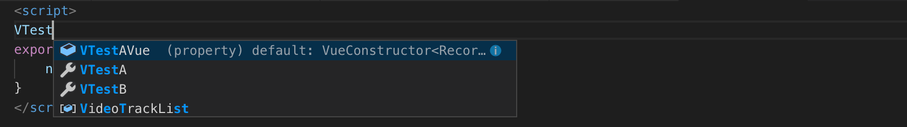
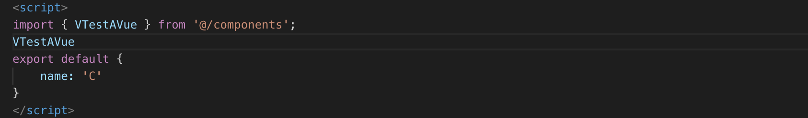
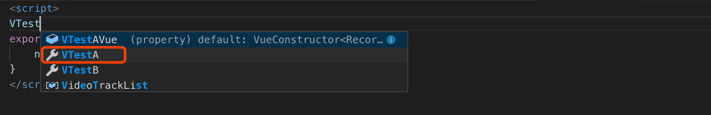
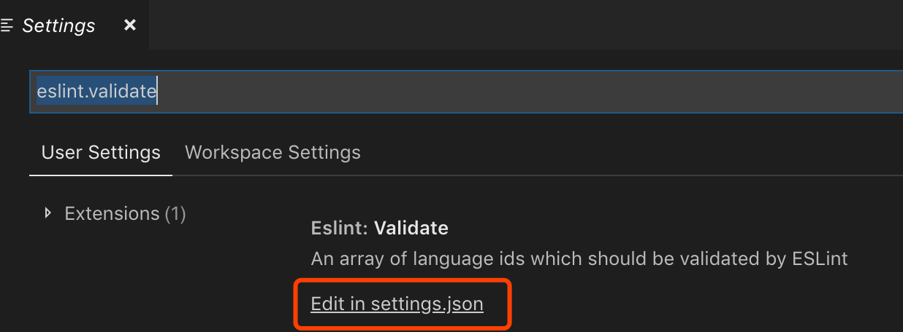
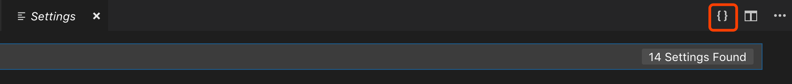
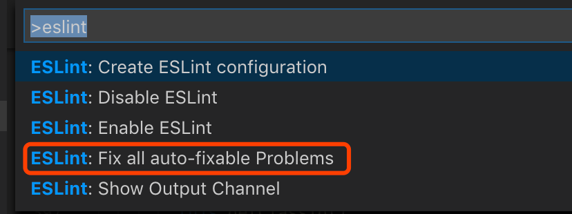
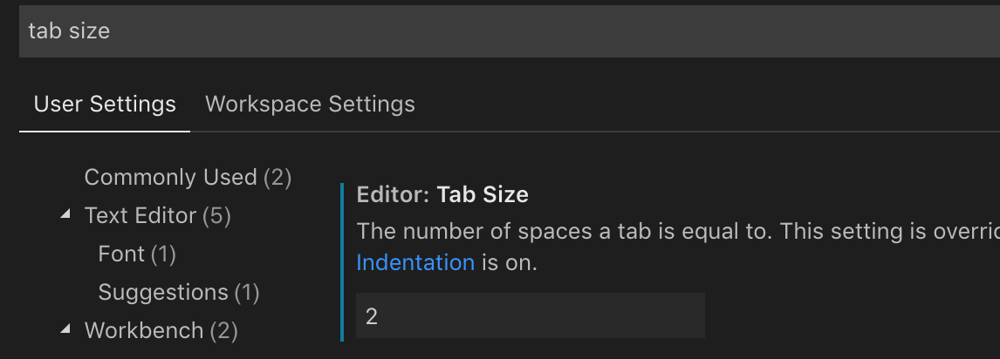
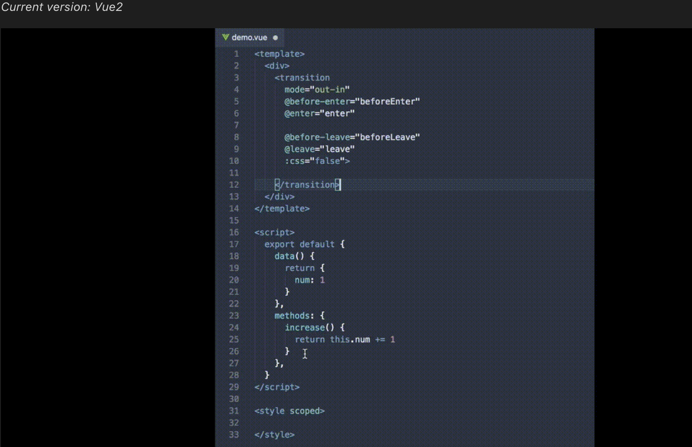

打开一个Vue项目，VS Code就会推荐我们安装功能强大的Vetur。这个插件支持语法高亮，安装重载之后，代码瞬间就漂亮起来了。

按照[Vetur](https://vuejs.github.io/vetur/setup.html)官网的介绍(具体内容参考官网)，根据项目需要选择安装`sass`等插件，安装[ESLint](https://marketplace.visualstudio.com/items?itemName=dbaeumer.vscode-eslint)代码检查插件。然后修改VS Code的`settings.js`，`eslint.validate`配置加上`vue`。最后添加`jsconfig.json`来帮助VS Code识别vue文件和其他`import`的文件。

### 自动`import`组件

在根目录添加`jsconfig.json`，由于我的项目中使用了webpack的`resolve.alias`，将目录`src`设置别名作`@`，这里应该加上相应的映射。


jsconfig.json
```json
    {
    "include": [
            "./src/**/*"
     ],
      "compilerOptions": {
          "baseUrl": ".",
          "paths": {
              "@/*": [
                  "src/*"
              ]
          }
      }
    }
```

我们重启VS Code来测试一下，现在有以下的目录结构:

```
+-- components
|   +-- VTestA.vue
|   +-- VTestB.vue
|   +-- index.js
+-- modules
|   +-- C.vue
```

components/index.js
```js
import VTestA from './VTestA'
import VTestB from './VTestB'
export {
  VTestA,
  VTestB
}
```
在C.vue里面输入VTestA，出现了VTestAVue提示,表示该组件：


选中之后，就自动从相应目录导入了这个单文件组件：


但是我们想要有一个统一的出口，把这两个组件整理到index中了，怎么从自动index中导出这个组件呢？
如下图，选择提示中的后一个选项，就会从index文件中导入该组件


但是这样引入的路径偶尔会出现错误。造成这个问题的原因是：当导入SFC的时候不能忽略`.vue`后缀，参考[这里](https://vuejs.github.io/vetur/FAQ.html#vetur-cannot-recognize-my-vue-component-import-such-as-import-comp-from-comp)。

这个组件`import`到`components/index.js`文件里的时候，路径的文件名没有写`.vue`扩展名，所以这里也无法自动的从`index.js`文件引入。如下加上扩展名就没有问题了。
components/index.js
```js
import VTestA from './VTestA.vue'
import VTestB from './VTestB.vue'
export {
  VTestA,
  VTestB
}
```

### ESLint相关配置

安装完[ESLint](https://marketplace.visualstudio.com/items?itemName=dbaeumer.vscode-eslint)之后，并没有对`.vue`文件起作用。
我们打开 VS Code 配置文件修改一下配置，让ESLint支持的语言包括`.vue`文件。
* On Windows/Linux - File > Preferences > Settings
* On macOS - Code > Preferences > Settings

搜索`eslint.validate`,我们选择直接打开json文件进行编辑：


右上角也有一个按钮能直接打开：


在配置文件中添加如下配置
```json
{
  "eslint.validate": [
    "javascript",
    "javascriptreact",
    {
      "language": "vue",
      "autoFix": true
    }
  ]
}
```
配置完成之后测试一下，在行末加个分号（ESLint推荐不使用分号），会出现红色波浪线提示。
注意上文配置中的`autoFix`，它用来自动修复有问题的写法，这个非常的方便。怎么样使用呢？
快捷键：
* On Windows/Linux - `Ctrl+shift+p`
* On macOS - `⇧⌘P`

打开命令面板，搜索一下eslint，可以看到这条`Fix all auto-fixable Problems`命令。回车执行一下，多余的分号就自动去掉了。常用的命令，VS Code会记录下来排在前列，后面使用打开命令面板就能看到了。



### `<template>` 校验

使用`iview`框架的时候，有一些组件会被标识语法错误。比如，这样使用`<Col></Col>`组件的时候，就会报错（由于html中`<col/>`是自闭合标签）。类似这种情况，我们想要修改模版的校验规则，要怎么做呢？
vetur支持对模版`<template>`进行校验，但是它内部使用的是一个固定版本的`eslint-plugin-vue`，并且不可配置。vetur官方给出的[建议](https://github.com/vuejs/vetur/blob/master/docs/linting-error.md#linting-for-template)是要关掉vetur的模版配置，自己安装`eslint-plugin-vue`。
* 在配置中，设置vetur.validation.template: false，关掉vetur模版校验，使用ESLint的；
* 在项目中安装`eslint-plugin-vue`插件；
* 在`.eslintrc`文件中设置ESLint规则。

比如刚才的`iview`组件的例子，配置如下：
.eslintrc
```json
{
  "extends": [
    "eslint:recommended",
    "plugin:vue/recommended"
  ],
  "rules": {
    "vue/no-parsing-error": [
       2,
      {
       "x-invalid-end-tag": false
      }
    ]
  }
}
```
### 其他细节

ESLint规则缩进是两个空格，但是VS Code默认的tab是4个空格，在配置中改成2个：



安装vue但文件组件的模版插件[`Vue VSCode Snippets`](https://marketplace.visualstudio.com/items?itemName=sdras.vue-vscode-snippets#overview)，方便我们快速新建`.vue`文件。




